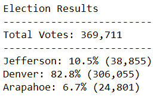
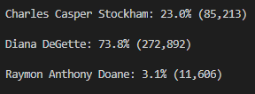
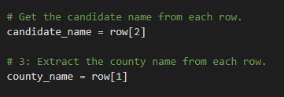

# Election_Analysis
Module 3 Python

# Project Overview
A Colorado Board of Elections requested that I complete the following tasks to complete the election audit of a recent local congressional election.

1. Calculate the Total Number of Votes Cast.
2. Get a complete list of the candidates who received votes.
3. Calculate the total number of votes each candidate won.
4. Calculate the percentage of votes each candidate won. 
5. Determine the winner of the election based on popular vote.

## Resources
 Data Source: election_results.csv
 Software: Python 3.9, Visual Studio Code, 1.54.2
  
 ## Overview of Election Audit:
 After completing the initial results analysis, I was asked by the election officials to provide some additional data:
 1. The voter turnout for each county
 2. The percentage of votes from each county out of the total count
 3. The county with the highest turnout

I applied *for* loops and conditional statements to the existing dataset to complete the audit, printing the results to the command line and to the election_results text file.
 
 ## Election-Audit Results:
 + There were 369,711 votes cast across the three counties for all candidates in this congressional election.
    - Denver County collected 82.8% of the vote.
    - Jefferson County collected 10.5% of the vote.
    - Arapahoe County comprised the smallest share of the total vote, 6.7%.
 #### Figure 1: County Vote Totals
 
 + Denver County was the county where the largest number of votes were cast, 306,055 votes.
 + The results were as follows:
    - In first place, and therefore the winning candidate, was Diana DeGette with 272,892 votes. This was 73.8% of all votes cast.
    - In second place with 85,213 votes (23% of popular vote) was Charles Casper Stockham.
    - In third place with a mere 3.1% or 11,606 votes was Raymon Anthony Doane.
 #### Figure 2: Final Results, 100% of Pricincts Reporting
 
 
 ## Election-Audit Summary:
 Our firm is honored to serve the fine State of Colorado and the Election Commission in safeguarding and verifying the most recent congressional election, and we look forward to continuing to support and protect this most treasured right, the right to vote, in future elections. Awarding the election analysis re-compete contract to our firm would lend the Government cost savings not present with other firms. Our proprietary script that was developed for this engagement, can be modified to support other applications with relative ease.
 
 **Figure 3** below, shows how our firm defined the key variables for the candidates and counties. These scripts could be modified to include other variables the government is interested in measuring. For example, if given the necessary data, we could define variables that measure track voter gender, income level, race/ ethnicity, or other demographic measures and provide insight into voter preferences. The government could make note of underrepresented demographics by providing overall population as well as registered voter population data to see which demographics are underrepresented in the electoral process. Armed with this information, public agencies could improve voter participation with targetted information campaigns to increase awareness of elections and ease the process of participating in the electoral process.
 
 #### Figure 3
 
 
It is important to keep in mind, whenever sharing voter data that identifiable factors are scrubbed and disconnected from the dataset as bad actors can capture this information and act with malicious intent based on this information. 
